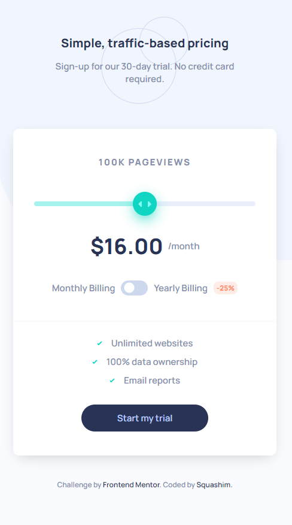
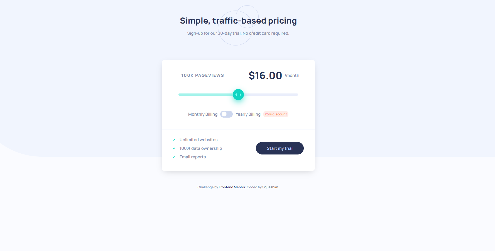

# Frontend Mentor - Interactive pricing component

## Table of contents

- [Screenshot](#screenshot) 
- [The challenge](#the-challenge)
- [Links](#links)
- [Author](#author)
### Screenshot

<table>
        <tr>
            <td>
                
            </td>
            <td>
                
            </td>
        </tr>
</table>

## The challenge

Your challenge is to build out this interactive pricing component and get it looking as close to the design as possible.

You can use any tools you like to help you complete the challenge. So if you've got something you'd like to practice, feel free to give it a go.

Your users should be able to:

- View the optimal layout for the app depending on their device's screen size
- See hover states for all interactive elements on the page
- Use the slider and toggle to see prices for different page view numbers

### Links

- Solution URL: [https://www.frontendmentor.io/solutions/responsive-pricing-component-with-js-and-sass-YbCiusIB1Q](https://www.frontendmentor.io/solutions/responsive-pricing-component-with-js-and-sass-YbCiusIB1Q)
- Live Site URL: [https://squashim.github.io/pricing-component/](https://squashim.github.io/pricing-component/)

## Author

- Website - [@Squashim](https://github.com/Squashim)
- Frontend Mentor - [@Squashim](https://www.frontendmentor.io/profile/Squashim)

**Have fun building!** 🚀

